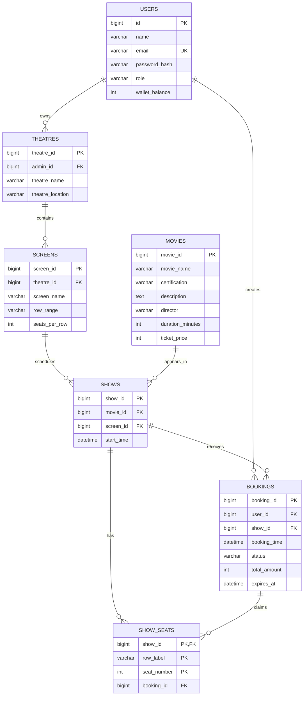

# Movie Ticket Booking System: System Design

## 1. Purpose and scope

This document describes the implemented design of the Movie Ticket Booking System. It is intended to be a factual reference for architectural reviews, generated reports, onboarding, migration planning, and future AI analysis.

The system supports two roles:

- **Customer**: registers, logs in, browses movies, discovers theatres and shows, views seat availability, books seats, pays from an application wallet, views personal bookings, and cancels eligible confirmed bookings.
- **Admin**: logs in and manages theatres, screens, and shows that belong to the admin's theatres. Movies are shared catalogue data and are not administered through the API.

The main business hierarchy is:

```text
User
  +-- Customer --> bookings --> show seats --> show --> screen --> theatre
  |                                      |                  |
  |                                      +--> movie         +--> admin owner
  |
  +-- Admin ---- owns -------------------------------> theatre
```

The application is a conventional server-side REST application with a static browser frontend. Its main architectural path is:

```text
Browser / HTTP client
        |
        v
Tomcat 10 + Jakarta Servlet + Jersey REST resources
        |
        v
Authentication filter and request role helpers
        |
        v
DTO mapping and resource/controller layer
        |
        v
Service layer: validation, authorization, business workflows
        |
        +------------------> Seat availability cache (read optimization)
        |
        v
Repository layer: JDBC queries and updates
        |
        v
MySQL relational database
```

## 2. Technology stack

| Area | Technology used | Role in the system |
| --- | --- | --- |
| Language/runtime | Java 17 | Application source and compilation target |
| Build | Maven | Dependency management, compilation, tests, and WAR packaging |
| Packaging | WAR, final name `movie-booking` | Deployment artifact for a servlet container |
| Web container | Apache Tomcat 10 | Hosts the WAR and Jakarta Servlet runtime |
| REST framework | Jersey 3.1.10 | Discovers resources, routes HTTP requests, and provides Jakarta REST integration |
| Dependency injection | Jersey HK2 | Constructs and injects resources, services, repositories, and the cache |
| JSON | Jackson through `jersey-media-json-jackson` 3.1.10 | Serializes request and response DTOs |
| Date/time JSON | `jackson-datatype-jsr310` 2.17.2 | Handles Java time types such as `LocalDateTime` |
| HTTP API | Jakarta REST / Servlet 6.0 | Resource annotations, request context, sessions, and HTTP responses |
| Persistence | JDBC with MySQL Connector/J 9.1.0 | Direct SQL access to MySQL |
| Database | MySQL, database `movie_booking` | Durable catalogue, identity, booking, seat occupancy, and wallet state |
| Password security | jBCrypt 0.4 | BCrypt password hashing and verification |
| In-memory concurrency/cache | Java concurrent collections and scheduled executors | Seat availability caching, active booking locks, and background cleanup |
| Testing | JUnit Jupiter 5.11.0 | Unit, repository/integration, and optional HTTP smoke tests |
| Frontend | Static HTML, CSS, and JavaScript under `backend/src/main/webapp` | Same-origin browser UI using relative `/api` requests and cookies |

## 3. Deployable and runtime components

### 3.1 Static frontend

The browser frontend is packaged inside the WAR under `backend/src/main/webapp`:

- `index.html` provides the application shell and controls.
- `styles.css` provides responsive presentation.
- `app.js` performs registration, login, logout, movie discovery, show and seat retrieval, booking, cancellation, and admin CRUD requests.

The frontend uses relative `/api` URLs and browser cookies. It does not own business state for seat reservations. A local seat selection is only a UI choice; a seat becomes occupied when the backend successfully claims it during booking.

### 3.2 Tomcat and Jersey runtime

Tomcat provides the servlet lifecycle and HTTP session implementation. Jersey is configured by `config.JerseyApplication`:

- REST resources are discovered from the `resource` package.
- Exception mappers are discovered from the `exception` package.
- Jackson JSON support is registered.
- Repositories and services are registered with HK2 dependency injection.
- One `SeatAvailabilityCache` instance is created and bound as a singleton.
- The application lifecycle registers startup and shutdown behavior.

The resource classes are thin HTTP adapters. They obtain identity and role from the request, call a service, and return DTOs or HTTP responses.

### 3.3 Authentication filter and sessions

`filter.AuthFilter` runs before protected resource handling:

1. It allows `OPTIONS` requests and explicitly public endpoints through.
2. Public endpoints include health, registration, login, movie GET routes, show listing, seat availability, and screen show listing.
3. For protected routes it reads `userId` and `role` from the server-side Tomcat `HttpSession`.
4. It rejects absent, malformed, or unknown session data with HTTP 401 and a JSON error.
5. It places the validated user ID and role on request attributes for downstream use.

`resource.RequestUsers` provides role-aware request helpers such as requiring a customer or requiring an admin. The service layer performs additional business and ownership checks, so HTTP filtering is not the only authorization boundary.

### 3.4 REST resource/controller layer

The resource classes and their responsibilities are:

| Resource | Base path | Responsibility |
| --- | --- | --- |
| `HealthResource` | `/health` | Public health response |
| `AuthResource` | `/auth` | Register, login, logout, and current-user profile |
| `MovieResource` | `/movies` | Public movie catalogue, details, and movie theatres |
| `ShowResource` | `/shows`, `/screens/{id}/shows` | Show discovery, seat availability, and admin show CRUD |
| `TheatreResource` | `/theatres` | Admin theatre listing and CRUD |
| `ScreenResource` | `/screens` | Admin screen listing and CRUD |
| `BookingResource` | `/bookings` | Customer booking creation, retrieval, listing, and cancellation |

Important endpoint groups:

```text
GET  /api/health
POST /api/auth/register
POST /api/auth/login
POST /api/auth/logout
GET  /api/auth/me

GET  /api/movies
GET  /api/movies/{movieId}
GET  /api/movies/{movieId}/theatres

GET  /api/shows
GET  /api/screens/{screenId}/shows
GET  /api/shows/{showId}/seats
POST /api/shows
PUT  /api/shows/{showId}
DELETE /api/shows/{showId}

GET  /api/theatres
POST /api/theatres
PUT  /api/theatres/{theatreId}
DELETE /api/theatres/{theatreId}

GET  /api/screens/theatre/{theatreId}
POST /api/screens
PUT  /api/screens/{screenId}
DELETE /api/screens/{screenId}

POST /api/bookings
GET  /api/bookings
GET  /api/bookings/{bookingId}
POST /api/bookings/{bookingId}/cancel
```

### 3.5 DTOs and models

DTOs are the boundary objects used for JSON input and output. They keep HTTP payload shape separate from persistence entities and internal workflow objects.

- Request DTOs include login, registration, theatre, screen, show, booking, and seat requests.
- Response DTOs include authentication, movie, theatre, show, booking, and seat responses.
- Models represent persisted domain records such as `User`, `Movie`, `Theatre`, `Screen`, `Show`, `Booking`, and `ShowSeat`.
- Enums constrain role and booking status values.

The normal direction is:

```text
JSON request -> request DTO -> service validation -> model/repository update
model/repository result -> service mapping -> response DTO -> JSON response
```

### 3.6 Service layer

Services own business rules and coordinate repositories and supporting components:

- `AuthService`: registration, BCrypt password handling, login verification, and user profile retrieval.
- `MovieService`: catalogue browsing, movie details, and discovery of theatres associated with shows for a movie.
- `TheatreService`: admin-owned theatre CRUD and lifecycle/ownership validation.
- `ScreenService`: screen CRUD, theatre ownership validation, and protection of screens with unfinished dependent shows.
- `ShowService`: show CRUD, movie/screen validation, show timing and overlap rules, ownership checks, and lifecycle rules.
- `BookingService`: seat validation, booking locks, booking transactions, payment orchestration, cancellation, expiry, and seat cache updates.
- `PaymentService`: simulated wallet debit/credit operations for customer payments and refunds.
- `BookingExpiryScheduler`: background polling that invokes pending booking expiry approximately every 30 seconds.

Services throw application exceptions rather than constructing ad hoc HTTP errors. `AppExceptionMapper` converts those exceptions to structured JSON responses.

### 3.7 Repository and JDBC layer

Repositories encapsulate SQL and map result sets to model objects. The repository set covers users, movies, theatres, screens, shows, bookings, and show seats.

`JdbcSupport` centralizes JDBC concerns such as obtaining the current connection, preparing statements, mapping data, and closing unmanaged resources. Repositories call `Database.current()` so they automatically participate in the current transaction when one exists.

There is no ORM in the implementation. SQL, JDBC statements, primary keys, foreign keys, indexes, and transaction boundaries are explicit.

### 3.8 Database connection and transaction management

`config.Database` loads `db.properties` from the classpath. Configuration precedence is:

1. Environment variables `DB_URL`, `DB_USER`, and `DB_PASSWORD`.
2. Java system properties `db.url`, `db.user`, and `db.password`.
3. Values in `db.properties`.

The MySQL JDBC driver is loaded during initialization. `Database.openConnection()` obtains a direct JDBC connection through `DriverManager`.

Transactions are managed with a `ThreadLocal<Connection>`:

- `Database.inTransaction(work)` opens a connection and disables auto-commit when the current thread is not already transactional.
- Repository calls on that thread reuse the transaction connection.
- Successful work is committed.
- Runtime failures cause rollback.
- The transaction connection is removed from the `ThreadLocal` and closed in the finalization path.
- Nested calls reuse the outer transaction rather than creating a second transaction.

This is a simple direct-connection design, not a connection-pool design. Payment and booking updates are atomic only for database operations executed inside the same transaction.

## 4. Relational database schema

The schema is created by `backend/src/main/resources/db/schema.sql` and uses MySQL `InnoDB` tables. The database is named `movie_booking` and uses `utf8mb4` with the `utf8mb4_unicode_ci` collation.

### 4.1 Entity relationship overview



### 4.2 `users`

Stores both customers and admins. There are no separate role tables.

| Column | Type | Constraints and meaning |
| --- | --- | --- |
| `id` | `BIGINT` | Auto-increment primary key |
| `name` | `VARCHAR(100)` | Required display name |
| `email` | `VARCHAR(255)` | Required and unique login identifier |
| `password_hash` | `VARCHAR(255)` | Required BCrypt hash; plaintext passwords are not intended to be stored |
| `role` | `VARCHAR(20)` | Required; database check allows `CUSTOMER` or `ADMIN` |
| `wallet_balance` | `INT` | Required, defaults to zero; used by simulated payment |

New public registrations are restricted to customers by the application. Admin accounts must be provisioned through the supported administrative setup rather than public customer registration.

### 4.3 `theatres`

Stores theatre ownership and location.

| Column | Type | Constraints and meaning |
| --- | --- | --- |
| `theatre_id` | `BIGINT` | Auto-increment primary key |
| `admin_id` | `BIGINT` | Required foreign key to `users.id`; owner/admin |
| `theatre_name` | `VARCHAR(150)` | Required name |
| `theatre_location` | `VARCHAR(255)` | Required location |

One admin can own many theatres. A theatre has one owner. Ownership is the root of the admin authorization chain.

### 4.4 `screens`

Stores a physical screen and its compact seat layout.

| Column | Type | Constraints and meaning |
| --- | --- | --- |
| `screen_id` | `BIGINT` | Auto-increment primary key |
| `theatre_id` | `BIGINT` | Required foreign key to `theatres.theatre_id` |
| `screen_name` | `VARCHAR(100)` | Required screen label |
| `row_range` | `VARCHAR(20)` | Required compact row definition, interpreted by `ShowTimes` |
| `seats_per_row` | `INT` | Required number of seats in each row |

Individual physical seats are not stored in a permanent seat table. The valid grid is calculated from `row_range` and `seats_per_row`.

### 4.5 `movies`

Stores global catalogue data. Admins associate movies with shows but do not own movies.

| Column | Type | Constraints and meaning |
| --- | --- | --- |
| `movie_id` | `BIGINT` | Auto-increment primary key |
| `movie_name` | `VARCHAR(200)` | Required title |
| `certification` | `VARCHAR(10)` | Required certification/rating |
| `description` | `TEXT` | Optional description |
| `director` | `VARCHAR(150)` | Optional director |
| `duration_minutes` | `INT` | Required duration, used for display and scheduling rules |
| `ticket_price` | `INT` | Required integer price per ticket |

Initial catalogue data is inserted by `seed.sql`. Movie mutation routes are not exposed in the current API.

### 4.6 `shows`

Associates a movie with a screen at a start time.

| Column | Type | Constraints and meaning |
| --- | --- | --- |
| `show_id` | `BIGINT` | Auto-increment primary key |
| `movie_id` | `BIGINT` | Required foreign key to `movies.movie_id` |
| `screen_id` | `BIGINT` | Required foreign key to `screens.screen_id` |
| `start_time` | `DATETIME` | Required show start |

The effective end time is derived from `start_time + movie.duration_minutes`; it is not stored. The service rejects past shows and overlapping shows on the same screen according to the scheduling rules.

### 4.7 `bookings`

Stores the customer booking aggregate and its lifecycle.

| Column | Type | Constraints and meaning |
| --- | --- | --- |
| `booking_id` | `BIGINT` | Auto-increment primary key |
| `user_id` | `BIGINT` | Required foreign key to the customer in `users.id` |
| `show_id` | `BIGINT` | Required foreign key to `shows.show_id` |
| `booking_time` | `DATETIME` | Required creation time |
| `status` | `VARCHAR(20)` | Required; `PENDING`, `CONFIRMED`, `CANCELLED`, or `EXPIRED` |
| `total_amount` | `INT` | Required price snapshot for the booking |
| `expires_at` | `DATETIME` | Nullable pending hold expiry time |

A newly created booking is `PENDING` and receives a five-minute expiry time. Successful payment changes it to `CONFIRMED` and clears `expires_at`. Failed or expired workflows do not leave an active seat claim after rollback or expiry processing.

### 4.8 `show_seats`

This is the sparse occupancy table. A row exists only after a booking claims a seat for a show.

| Column | Type | Constraints and meaning |
| --- | --- | --- |
| `show_id` | `BIGINT` | Part of composite primary key; foreign key to `shows.show_id` |
| `row_label` | `VARCHAR(1)` | Part of composite primary key; normalized uppercase row |
| `seat_number` | `INT` | Part of composite primary key; positive seat position |
| `booking_id` | `BIGINT` | Required foreign key to `bookings.booking_id` |

The composite primary key `(show_id, row_label, seat_number)` is the durable concurrency guard. It permits at most one active occupancy row for a physical seat in a particular show. The `booking_id` index supports loading all seats for a booking.

Seat availability is derived as follows:

```text
valid seats = rows generated from screen.row_range
              x seat numbers 1..screen.seats_per_row

occupied seats = matching rows in show_seats for the show

available seats = valid seats - occupied seats
```

The schema does not store an `AVAILABLE`, `HELD`, or `BOOKED` value. Booking status and row existence provide the durable state model.

### 4.9 Indexes and integrity

Foreign keys preserve relationships between users, theatres, screens, movies, shows, bookings, and seat claims. Additional indexes support common access paths:

- `uk_users_email` enforces unique login email.
- `idx_show_seats_booking` finds all seats in a booking.
- `idx_shows_movie` finds shows for a movie.
- `idx_shows_screen` finds shows for a screen.
- `idx_bookings_user` finds a customer's bookings.
- `idx_bookings_pending_expiry` finds pending bookings eligible for expiry.

## 5. In-memory state and consistency model

### 5.1 Seat availability cache

`SeatAvailabilityCache` is a thread-safe, per-show read cache. It stores a map from seat key such as `A-5` to an in-memory status:

- `HELD`: associated with a pending booking or active short-lived hold marker.
- `BOOKED`: associated with confirmed occupancy.

The cache is an optimization and is not the source of truth. The database `show_seats` primary key and booking transaction decide whether a booking succeeds.

Cache behavior:

1. A seat availability request checks the cache.
2. A valid cache hit returns occupancy without a database query.
3. A miss queries `show_seats`, converts `PENDING` booking occupancy to `HELD`, and other occupancy to `BOOKED`, then populates the cache.
4. Booking creation adds seats as `HELD` after successful database claims.
5. Successful payment changes those seats to `BOOKED`.
6. Cancellation and pending expiry remove the seats surgically.
7. Entries have TTL/expiry behavior and are cleaned by a daemon scheduler every five seconds.
8. Active hold markers use a five-minute TTL and are merged into cached occupancy when read.

A stale or missing cache can cause an extra database read, but it must not be used to authorize a booking. Booking always attempts the database claim.

### 5.2 In-process booking locks

`BookingService` maintains a `ConcurrentHashMap` of active lock keys formatted from show ID and normalized seat, for example `42:A-5`.

For each request:

1. Seat labels are normalized and lock keys are deduplicated.
2. Keys are sorted to provide deterministic acquisition order.
3. `putIfAbsent` rejects a request if another in-process request is already handling one of the same seats.
4. Locks are removed in a `finally` block.

These locks reduce same-JVM contention. They do not replace the database composite primary key, which remains necessary for correctness across threads, processes, or multiple application instances.

## 6. Authorization and ownership model

Authorization is layered:

```text
AuthFilter
  -> session exists and role is syntactically valid
RequestUsers
  -> endpoint requires CUSTOMER or ADMIN
Service
  -> user owns the resource and the operation is valid in its lifecycle
Repository/database
  -> foreign keys and unique constraints enforce persistence integrity
```

Admin ownership is transitive:

```text
admin -> theatre.admin_id
       -> screen.theatre_id
       -> show.screen_id
```

Therefore an admin may manage a screen only when its theatre belongs to that admin, and may manage a show only when its screen resolves to a theatre owned by that admin. Customer booking and retrieval operations also verify the customer identity against the booking owner.

The service layer additionally protects resources that have unfinished shows or bookings from unsafe update/delete operations, according to the implemented theatre, screen, and show lifecycle rules.

## 7. End-to-end data flows

### 7.1 Application startup

```text
Tomcat deploys WAR
  -> servlet/Jersey initialization
  -> Database initialization loads configuration and MySQL driver
  -> JerseyApplication registers packages and Jackson
  -> HK2 binds repositories and services
  -> SeatAvailabilityCache is created
  -> cache cleanup scheduler starts
  -> RuntimeLifeCycle starts booking-expiry scheduler
  -> resources become available under /api
```

The cache cleanup task runs every five seconds. The booking expiry task runs approximately every thirty seconds. Both use daemon threads.

### 7.2 Customer registration

```text
Browser
  -> POST /api/auth/register with RegisterRequest JSON
AuthResource
  -> AuthService.register
AuthService
  -> validate input and force public registration role to CUSTOMER
  -> hash password with BCrypt
  -> create User with initial wallet balance
UserRepository
  -> INSERT users
Database
  -> commit user row
AuthService
  -> map User to AuthResponse
Jersey/Jackson
  -> HTTP 201 JSON response
```

The email uniqueness constraint and service validation prevent invalid duplicate identities. Password hashes, not plaintext passwords, are persisted.

### 7.3 Login, session, and protected request

```text
Browser
  -> POST /api/auth/login
AuthResource
  -> AuthService.login
AuthService
  -> UserRepository lookup by email
  -> BCrypt password verification
AuthResource
  -> store userId and role in HttpSession
  -> return AuthResponse

Later protected request
  -> AuthFilter reads HttpSession
  -> validates userId and role
  -> attaches request attributes
  -> RequestUsers enforces endpoint role
  -> resource calls service
```

Logout invalidates the server-side session. A missing or malformed session receives HTTP 401 before protected resource execution.

### 7.4 Public movie and show discovery

```text
Browser
  -> GET /movies or /movies/{id}
MovieResource
  -> MovieService
MovieRepository
  -> SELECT movie data
MovieService
  -> map model to MovieResponse or MovieDetailsResponse
  -> JSON response
```

For theatre discovery:

```text
GET /movies/{movieId}/theatres
  -> MovieService
  -> validate/find movie
  -> query shows joined through screens and theatres
  -> map distinct theatre results
```

For show discovery, `ShowResource` delegates to `ShowService`, which queries shows by movie or screen and joins the related movie, screen, and theatre data as needed for response DTOs.

### 7.5 Seat availability query

```text
GET /shows/{showId}/seats
  -> ShowResource
  -> BookingService.getAvailableSeats
  -> ShowRepository finds show
  -> ScreenRepository finds screen layout
  -> SeatAvailabilityCache.get(showId)
       | cache hit: use valid occupancy and merge active holds
       | cache miss: ShowSeatRepository queries show_seats
                    -> convert pending occupancy to HELD
                    -> convert other occupancy to BOOKED
                    -> populate cache
  -> ShowTimes generates valid row labels
  -> service creates SeatResponse for every valid grid position
  -> HTTP JSON list with AVAILABLE, HELD, or BOOKED status
```

The screen layout determines the complete grid. Sparse `show_seats` rows determine which positions are unavailable.

### 7.6 Admin creates a theatre, screen, and show

The management flow is a sequence of authenticated admin operations:

```text
Admin browser
  -> POST /theatres
AuthFilter + RequestUsers
  -> require ADMIN
TheatreService
  -> validate request
  -> save theatre with current admin ID
TheatreRepository
  -> INSERT theatres
  -> response

Admin browser
  -> POST /screens
ScreenService
  -> require theatre ownership
  -> validate row range and seats per row
ScreenRepository
  -> INSERT screens
  -> response

Admin browser
  -> POST /shows
ShowService
  -> require screen -> theatre -> current admin ownership
  -> find movie and screen
  -> reject past start time
  -> calculate movie end time
  -> reject overlap on the same screen
ShowRepository
  -> INSERT shows
  -> response
```

Updates and deletes repeat the ownership checks and apply lifecycle restrictions. Shows with dependent bookings or unfinished show activity are protected from unsafe changes.

### 7.7 Booking and payment flow

This is the most consistency-sensitive workflow.

```text
Customer browser
  -> POST /bookings with showId and selected seats
BookingResource
  -> require CUSTOMER
BookingService.bookTickets
  -> validate request shape
  -> normalize and sort per-seat in-process lock keys
  -> acquire all lock keys or return HTTP 409
  -> Database.inTransaction
       -> validate customer role
       -> load future show, screen, movie, and theatre
       -> validate each row and seat number
       -> reject duplicate selected seats
       -> compute movie.ticket_price * seat count with overflow check
       -> INSERT bookings as PENDING with expires_at = now + 5 minutes
       -> for each seat:
            normalize row label
            INSERT show_seats
            if composite key conflicts: fail with HTTP 409
       -> add claimed seats to cache as HELD
       -> PaymentService.processPayment
            -> validate positive amount
            -> debit customer wallet atomically
            -> credit theatre admin wallet
            -> insufficient balance: fail and rollback
       -> update booking to CONFIRMED
       -> clear expires_at
       -> mark cache seats BOOKED
       -> commit
  -> release in-process locks in finally
  -> return HTTP 201 BookingResponse
```

The database transaction includes booking creation, seat claims, wallet movements, and confirmation. A runtime failure rolls back the database changes. The `show_seats` composite primary key is the final durable guard against double booking. Payment is simulated by wallet updates; there is no external payment gateway.

The configured payment delay defaults to 15 seconds and can be overridden with the Java system property `booking.payment.delay.ms`. This delay models payment processing and increases the period during which contention behavior can be observed.

### 7.8 Cancellation and refund flow

```text
Customer browser
  -> POST /bookings/{bookingId}/cancel
BookingResource
  -> require CUSTOMER
BookingService.cancelBooking
  -> Database.inTransaction
       -> load booking
       -> verify booking belongs to current customer
       -> require status CONFIRMED
       -> load show and reject cancellation after show start
       -> load screen and theatre/admin owner
       -> calculate refund:
            more than 30 minutes before start: 100%
            within 30 minutes before start: 75%
       -> PaymentService.refundPayment
            -> debit admin wallet
            -> credit customer wallet
       -> load booking show_seats
       -> delete all seat claims
       -> update booking status to CANCELLED
       -> remove seats from cache
       -> commit
  -> HTTP 204 response
```

The refund calculation is based on the stored booking total and show start time. The database transaction keeps wallet reversal, seat release, and booking status change together.

### 7.9 Pending booking expiry

```text
BookingExpiryScheduler
  -> every approximately 30 seconds
  -> BookingService.expirePendingBookings
  -> Database.inTransaction
       -> find bookings with status PENDING and expires_at <= now
       -> load each booking's show_seats
       -> delete seat claims
       -> set booking status EXPIRED
       -> clear expires_at
       -> remove released seats from cache
       -> commit
```

Expiry is a server-side cleanup mechanism. It releases durable seat claims left by incomplete booking workflows and makes the seats available again.

### 7.10 Error flow

```text
Validation/authorization/business failure
  -> service throws typed AppException subclass
  -> AppExceptionMapper catches exception
  -> maps to JSON error and status code
  -> Jersey sends response
```

The documented status mapping is:

| Condition | HTTP status |
| --- | ---: |
| Invalid request or business validation | 400 |
| Missing/invalid authentication session | 401 |
| Authenticated user lacks role or ownership | 403 |
| Entity does not exist | 404 |
| Seat or other state conflict | 409 |

Unexpected runtime failures are handled by the application/container error path rather than being disguised as a business success.

## 8. State transitions and invariants

### 8.1 Booking status transitions

```text
                 payment succeeds
       +------------------------------+
       |                              v
[new] -> PENDING -----------------> CONFIRMED
          |                           |
          | expiry                    | eligible cancellation
          v                           v
       EXPIRED                    CANCELLED

PENDING -> rollback/no persisted booking on transaction failure
CONFIRMED cannot be cancelled after show start
```

Key invariants:

- A confirmed booking has one or more corresponding `show_seats` rows until cancellation.
- A seat cannot be claimed twice for the same show because of the composite primary key.
- A pending booking expires after five minutes unless payment confirms it first.
- A cancelled or expired booking has its seat claims removed.
- Customer payment debits the customer wallet and credits the theatre admin wallet in the same database transaction.
- A cancellation reverses the configured refund amount from admin to customer.
- A booking can be retrieved only by its owning customer through the customer booking endpoints.
- The cache may be stale or empty, but it must not override the database claim result.

### 8.2 Seat state interpretation

Durable state is inferred rather than represented by a status column:

| Database condition | API/cache interpretation |
| --- | --- |
| No `show_seats` row for a valid grid position | `AVAILABLE` |
| Row belongs to a `PENDING` booking | `HELD` |
| Row belongs to a `CONFIRMED` booking | `BOOKED` |
| Row belongs to cancelled/expired booking | Should be absent after cleanup |

## 9. Design decisions and intentional simplifications

- One `users` table represents both roles.
- Movies are global catalogue entities and are seeded/read-only through the current API.
- There is no genre table.
- Ticket price is stored on `movies`; there is no show-specific, VIP, weekend, or dynamic pricing.
- Physical seats are derived from screen geometry; there is no permanent seat table.
- There is no separate `booking_seat` join table. `show_seats.booking_id` directly links each claimed seat to its booking.
- Payment is a simulated internal wallet transfer, not a real payment integration.
- Authentication uses server-side Tomcat sessions and cookies, not JWT tokens.
- JDBC is used directly without an ORM.
- The cache and booking locks are process-local. Horizontal deployment requires the database constraints to remain authoritative and may require shared cache/distributed locking if stronger cache coordination is needed.
- Database connections are opened through `DriverManager`; the current implementation does not configure a production connection pool.

## 10. Operational and testing notes

The backend status records the following verified capabilities:

- Maven WAR packaging and Tomcat deployment.
- Jersey resource discovery and dependency injection.
- MySQL connectivity and startup initialization.
- Registration, login, session cookies, logout, and current-user lookup.
- Public movie catalogue access and health checks.
- Database uniqueness behavior for concurrent seat claims.
- Rollback when wallet balance is insufficient.
- Pending booking expiry and seat release.
- Full and partial refund wallet movement.
- Confirmed cancellation and rejection after show start.
- Structured HTTP errors for validation, authentication, authorization, missing resources, and conflicts.

The principal remaining verification areas are complete endpoint authorization matrices, cross-admin ownership isolation, all repository mappings, end-to-end HTTP booking/cancellation/concurrency flows, browser verification after admin setup, clean scheduler shutdown, and production deployment configuration.

## 11. Architecture summary

The system is a layered Java REST application:

```text
Presentation
  Static browser frontend and JSON HTTP clients

Transport/API
  Tomcat, Jakarta Servlet, Jersey resources, Jackson

Security boundary
  Session authentication filter and role-aware request helpers

Application layer
  Auth, catalogue, theatre, screen, show, booking, payment services

Cross-cutting runtime state
  JDBC transaction context, seat cache, in-process booking locks,
  booking expiry scheduler, cache cleanup scheduler

Persistence
  JDBC repositories and MySQL InnoDB schema
```

The central consistency strategy is deliberately dual-layered: fast seat reads can use the in-memory cache, while every booking must pass through a transactional database insert protected by the `show_seats` composite key. This separates performance concerns from correctness concerns and keeps durable booking state in MySQL.
